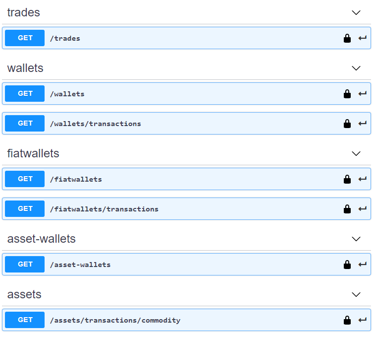

# 🐼 Bitpanda Public API

## OpenAPI 3.0 definition for bitpanda.com public API

- 😕 Bitpanda does not provide any Swagger or OpenAPI specifications
- 🔥 Official documentation: https://developers.bitpanda.com/platform/
- 🚀 Use this YAML to generate API clients for any language with
    - C#: https://github.com/RicoSuter/NSwag
    - JS/TS: https://swagger.io/tools/swagger-codegen/
    - any other tool supporting OpenAPI 3.0
- 😎 Check it out right now: 
    - you need an API key from https://web.bitpanda.com/apikey
    - https://app.swaggerhub.com/apis/macgyver2k/BitPanda/1.0.0-oas3    
        - click 'Authorize' on the top right side and enter API key

 

---

### The full specification converted to markdown via `openapi-markdown`
- https://github.com/theBenForce/openapi-markdown

---

### /wallets

#### GET
##### Parameters

| Name | Located in | Description | Required | Schema |
| ---- | ---------- | ----------- | -------- | ---- |
| type | query |  | No | string |
| page | query |  | No | integer |
| page_size | query |  | No | integer |

##### Responses

| Code | Description |
| ---- | ----------- |
| 200 |  |

### /trades

#### GET
##### Parameters

| Name | Located in | Description | Required | Schema |
| ---- | ---------- | ----------- | -------- | ---- |
| type | query |  | No | [TradeType](#tradetype) |
| page | query |  | No | integer |
| page_size | query |  | No | integer |

##### Responses

| Code | Description |
| ---- | ----------- |
| 200 |  |

### /wallets/transactions

#### GET
##### Parameters

| Name | Located in | Description | Required | Schema |
| ---- | ---------- | ----------- | -------- | ---- |
| type | query |  | No | [TransactionType](#transactiontype) |
| page | query |  | No | integer |
| page_size | query |  | No | integer |

##### Responses

| Code | Description |
| ---- | ----------- |
| 200 |  |

### /fiatwallets

#### GET
##### Description:

Get all user wallets

##### Responses

| Code | Description |
| ---- | ----------- |
| 200 | All user wallets |

### /fiatwallets/transactions

#### GET
##### Parameters

| Name | Located in | Description | Required | Schema |
| ---- | ---------- | ----------- | -------- | ---- |
| type | query |  | No | [FiatWalletTransactionType](#fiatwallettransactiontype) |
| page | query |  | No | integer |
| page_size | query |  | No | integer |

##### Responses

| Code | Description |
| ---- | ----------- |
| 200 |  |

### /asset-wallets

#### GET
##### Description:

Get user's wallets based on assets

##### Responses

| Code | Description |
| ---- | ----------- |
| 200 | All user's wallets based on assets |

### /assets/transactions/commodity

#### GET
##### Description:

Get user's commodity transactions

##### Parameters

| Name | Located in | Description | Required | Schema |
| ---- | ---------- | ----------- | -------- | ---- |
| page | query | Used for pagination of response | No | integer |
| page_size | query | Size of a page for the paginated response | No | integer |

##### Responses

| Code | Description |
| ---- | ----------- |
| 200 | All user's wallets based on assets |

### Models

#### AssetCommodityTransactionsResult

| Name | Type | Description | Required |
| ---- | ---- | ----------- | -------- |
| data | [ [AssetCommodityTransaction](#assetcommoditytransaction) ] |  | Yes |
| meta | [PagingResult](#pagingresult) |  | Yes |
| links | [AssetCommodityTransactionsResultLinksResult](#assetcommoditytransactionsresultlinksresult) |  | Yes |

#### AssetCommodityTransaction

| Name | Type | Description | Required |
| ---- | ---- | ----------- | -------- |
| type | string |  | Yes |
| attributes | [AssetCommodityTransactionAttributes](#assetcommoditytransactionattributes) |  | Yes |

#### AssetCommodityTransactionAttributes

| Name | Type | Description | Required |
| ---- | ---- | ----------- | -------- |
| amount | string (decimal) |  | Yes |
| recipient | string |  | Yes |
| time | [TimeResult](#timeresult) |  | Yes |
| confirmations | integer |  | Yes |
| in_or_out | [TransactionDirection](#transactiondirection) |  | Yes |
| type | [TransactionType](#transactiontype) |  | Yes |
| status | [TransactionStatus](#transactionstatus) |  | Yes |
| amount_eur | string (decimal) |  | Yes |
| purpose_text | string |  | Yes |
| related_wallet_transaction_id | string (uuid) |  | Yes |
| related_wallet_id | string (uuid) |  | Yes |
| wallet_id | string (uuid) |  | Yes |
| confirmed | boolean |  | Yes |
| cryptocoin_id | string |  | Yes |
| cryptocoin_symbol | string |  | No |
| trade_id | string |  | No |
| trade | [Trade](#trade) |  | No |
| last_changed | [TimeResult](#timeresult) |  | Yes |
| fee | string (decimal) |  | Yes |
| current_fiat_id | string |  | Yes |
| current_fiat_amount | string (decimal) |  | Yes |
| tx_id | string |  | Yes |
| is_savings | boolean |  | No |
| is_bfc | boolean |  | No |
| is_card | boolean |  | No |
| tags | [ string ] |  | No |
| public_status | [TransactionPublicStatus](#transactionpublicstatus) |  | No |

#### AssetCommodityTransactionsResultLinksResult

| Name | Type | Description | Required |
| ---- | ---- | ----------- | -------- |
| self | string (url) |  | Yes |

#### AssetWalletsResult

| Name | Type | Description | Required |
| ---- | ---- | ----------- | -------- |
| type | [AssetWalletsResultData](#assetwalletsresultdata) |  | No |

#### AssetWalletsResultData

| Name | Type | Description | Required |
| ---- | ---- | ----------- | -------- |
| type | string |  | No |
| attributes | [AssetWalletsResultDataAttributes](#assetwalletsresultdataattributes) |  | No |

#### AssetWalletsResultDataAttributes

| Name | Type | Description | Required |
| ---- | ---- | ----------- | -------- |
| cryptocoin | [AssetWalletsResultCollection](#assetwalletsresultcollection) |  | Yes |
| commodity | [AssetWalletsResultDataCommodity](#assetwalletsresultdatacommodity) |  | Yes |
| index | [AssetWalletsResultDataIndex](#assetwalletsresultdataindex) |  | Yes |
| security | [AssetWalletsResultDataSecurity](#assetwalletsresultdatasecurity) |  | Yes |

#### AssetWalletsResultCollection

| Name | Type | Description | Required |
| ---- | ---- | ----------- | -------- |
| type | string |  | Yes |
| attributes | [AssetWalletsAttributes](#assetwalletsattributes) |  | Yes |

#### AssetWalletsAttributes

| Name | Type | Description | Required |
| ---- | ---- | ----------- | -------- |
| wallets | [ [Wallet](#wallet) ] |  | Yes |

#### AssetWalletsResultDataCommodity

| Name | Type | Description | Required |
| ---- | ---- | ----------- | -------- |
| metal | [AssetWalletsResultCollection](#assetwalletsresultcollection) |  | Yes |

#### AssetWalletsResultDataIndex

| Name | Type | Description | Required |
| ---- | ---- | ----------- | -------- |
| index | [AssetWalletsResultCollection](#assetwalletsresultcollection) |  | Yes |

#### AssetWalletsResultDataSecurity

| Name | Type | Description | Required |
| ---- | ---- | ----------- | -------- |
| stock | [AssetWalletsResultCollection](#assetwalletsresultcollection) |  | Yes |
| etf | [AssetWalletsResultCollection](#assetwalletsresultcollection) |  | Yes |

#### FiatWalletsResult

| Name | Type | Description | Required |
| ---- | ---- | ----------- | -------- |
| data | [ [FiatWallet](#fiatwallet) ] |  | Yes |
| meta | [PagingResult](#pagingresult) |  | Yes |
| links | [LinksResult](#linksresult) |  | Yes |

#### FiatWallet

| Name | Type | Description | Required |
| ---- | ---- | ----------- | -------- |
| id | string (uuid) |  | Yes |
| type | string |  | Yes |
| attributes | [FiatWalletAttributes](#fiatwalletattributes) |  | Yes |

#### FiatWalletAttributes

| Name | Type | Description | Required |
| ---- | ---- | ----------- | -------- |
| fiat_id | string |  | No |
| fiat_symbol | string |  | No |
| ballance | string (decimal) |  | No |
| name | string |  | No |
| pending_transactions_count | integer |  | No |

#### FiatWalletTransactionsResult

| Name | Type | Description | Required |
| ---- | ---- | ----------- | -------- |
| data | [ [FiatWalletTransaction](#fiatwallettransaction) ] |  | Yes |
| meta | [PagingResult](#pagingresult) |  | Yes |
| links | [LinksResult](#linksresult) |  | Yes |

#### FiatWalletTransaction

| Name | Type | Description | Required |
| ---- | ---- | ----------- | -------- |
| id | string (uuid) |  | Yes |
| type | string |  | Yes |
| attributes | [FiatWalletTransactionAttributes](#fiatwallettransactionattributes) |  | Yes |

#### FiatWalletTransactionAttributes

| Name | Type | Description | Required |
| ---- | ---- | ----------- | -------- |
| fiat_wallet_id | string (uuid) |  | Yes |
| user_id | string (uuid) |  | Yes |
| fiat_id | string (int32) |  | Yes |
| amount | string (decimal) |  | Yes |
| fee | string (decimal) |  | Yes |
| to_eur_rate | string (decimal) |  | Yes |
| in_or_out | [TransactionDirection](#transactiondirection) |  | Yes |
| time | [TimeResult](#timeresult) |  | Yes |
| type | [TransactionType](#transactiontype) |  | Yes |
| status | [TransactionStatus](#transactionstatus) |  | Yes |
| confirmed | boolean |  | Yes |
| confirmation_by | [TransactionConfirmationBy](#transactionconfirmationby) |  | Yes |
| requires_2fa_approval | boolean |  | Yes |
| payment_option_id | string |  | Yes |
| last_changed | [TimeResult](#timeresult) |  | Yes |
| trade | [Trade](#trade) |  | No |
| is_savings | boolean |  | No |
| is_card | boolean |  | No |
| is_index | boolean |  | No |
| tags | [ string ] |  | No |
| public_status | [TransactionPublicStatus](#transactionpublicstatus) |  | No |

#### TransactionConfirmationBy

| Name | Type | Description | Required |
| ---- | ---- | ----------- | -------- |
| TransactionConfirmationBy | string |  |  |

#### TransactionType

| Name | Type | Description | Required |
| ---- | ---- | ----------- | -------- |
| TransactionType | string |  |  |

#### FiatWalletTransactionType

| Name | Type | Description | Required |
| ---- | ---- | ----------- | -------- |
| FiatWalletTransactionType | string |  |  |

#### WalletTransactionsResult

| Name | Type | Description | Required |
| ---- | ---- | ----------- | -------- |
| data | [ [WalletTransaction](#wallettransaction) ] |  | Yes |
| meta | [PagingResult](#pagingresult) |  | Yes |
| links | [LinksResult](#linksresult) |  | Yes |

#### WalletTransaction

| Name | Type | Description | Required |
| ---- | ---- | ----------- | -------- |
| id | string (uuid) |  | Yes |
| type | string |  | Yes |
| attributes | [WalletTransactionAttributes](#wallettransactionattributes) |  | Yes |

#### WalletTransactionAttributes

| Name | Type | Description | Required |
| ---- | ---- | ----------- | -------- |
| amount | string (decimal) |  | Yes |
| recipient | string |  | Yes |
| time | [TimeResult](#timeresult) |  | Yes |
| confirmations | integer |  | Yes |
| in_or_out | [TransactionDirection](#transactiondirection) |  | Yes |
| type | [TransactionType](#transactiontype) |  | Yes |
| status | [TransactionStatus](#transactionstatus) |  | Yes |
| amount_eur | string (decimal) |  | Yes |
| purpose_text | string |  | Yes |
| related_wallet_transaction_id | string (uuid) |  | Yes |
| related_wallet_id | string (uuid) |  | Yes |
| wallet_id | string (uuid) |  | Yes |
| confirmed | boolean |  | Yes |
| cryptocoin_id | string |  | Yes |
| cryptocoin_symbol | string |  | No |
| trade_id | string |  | No |
| trade | [Trade](#trade) |  | No |
| last_changed | [TimeResult](#timeresult) |  | Yes |
| fee | string (decimal) |  | Yes |
| current_fiat_id | string |  | Yes |
| current_fiat_amount | string (decimal) |  | Yes |
| tx_id | string |  | Yes |
| is_savings | boolean |  | No |
| is_bfc | boolean |  | No |
| is_card | boolean |  | No |
| tags | [ string ] |  | No |
| public_status | [TransactionPublicStatus](#transactionpublicstatus) |  | No |

#### TransactionPublicStatus

| Name | Type | Description | Required |
| ---- | ---- | ----------- | -------- |
| TransactionPublicStatus | string |  |  |

#### TransactionDirection

| Name | Type | Description | Required |
| ---- | ---- | ----------- | -------- |
| TransactionDirection | string |  |  |

#### TransactionStatus

| Name | Type | Description | Required |
| ---- | ---- | ----------- | -------- |
| TransactionStatus | string |  |  |

#### Wallet

| Name | Type | Description | Required |
| ---- | ---- | ----------- | -------- |
| type | string |  | Yes |
| id | string (uuid) |  | Yes |
| attributes | [WalletAttributes](#walletattributes) |  | Yes |

#### WalletAttributes

| Name | Type | Description | Required |
| ---- | ---- | ----------- | -------- |
| cryptocoin_id | string |  | Yes |
| cryptocoin_symbol | string |  | Yes |
| balance | string (decimal) |  | Yes |
| is_default | boolean |  | Yes |
| name | string |  | Yes |
| pending_transactions_count | integer |  | Yes |
| deleted | boolean |  | Yes |
| is_index | boolean |  | Yes |

#### TradeType

| Name | Type | Description | Required |
| ---- | ---- | ----------- | -------- |
| TradeType | string |  |  |

#### TradeAttributes

| Name | Type | Description | Required |
| ---- | ---- | ----------- | -------- |
| status | string |  | Yes |
| type | [TradeType](#tradetype) |  | Yes |
| cryptocoin_id | string |  | Yes |
| fiat_id | string |  | Yes |
| amount_fiat | string (decimal) |  | Yes |
| amount_cryptocoin | string |  | Yes |
| fiat_to_eur_rate | string (decimal) |  | Yes |
| wallet_id | string (uuid) |  | Yes |
| fiat_wallet_id | string (uuid) |  | Yes |
| payment_option_id | string |  | Yes |
| time | [TimeResult](#timeresult) |  | Yes |
| price | string (decimal) |  | Yes |
| is_swap | boolean |  | Yes |
| is_savings | boolean |  | No |
| is_card | boolean |  | No |
| bfc_used | boolean |  | No |
| tags | [ string ] |  | No |

#### TimeResult

| Name | Type | Description | Required |
| ---- | ---- | ----------- | -------- |
| date_iso8601 | dateTime |  | Yes |
| unix | string (int32) |  | Yes |

#### Trade

| Name | Type | Description | Required |
| ---- | ---- | ----------- | -------- |
| id | string (uuid) |  | Yes |
| type | string |  | Yes |
| attributes | [TradeAttributes](#tradeattributes) |  | Yes |

#### LinksResult

| Name | Type | Description | Required |
| ---- | ---- | ----------- | -------- |
| next | string (url) |  | Yes |
| last | string (url) |  | Yes |
| self | string (url) |  | Yes |

#### PagingResult

| Name | Type | Description | Required |
| ---- | ---- | ----------- | -------- |
| page | integer |  | Yes |
| page_size | integer |  | Yes |
| total_count | integer |  | Yes |

#### TradesResult

| Name | Type | Description | Required |
| ---- | ---- | ----------- | -------- |
| data | [ [Trade](#trade) ] |  | Yes |
| meta | [PagingResult](#pagingresult) |  | Yes |
| links | [LinksResult](#linksresult) |  | Yes |